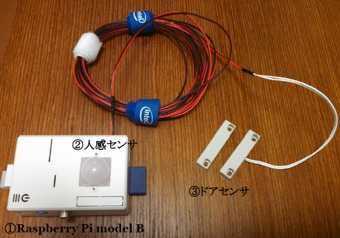

WetherVoice
=====================================================
このシステムは天気予報を通知する機能を備えます。
Raspberry Piを利用したソリューションです。

環境
=====
### 必須
* Raspberry Pi

### オプション
* PIRセンサーモジュール [A500BP]
* ケース入りリードスイッチ（磁石付セット）MC-14AC

設定
=====

### check_wether.sh
以下の欄を自分の住所に近いアドレスへ変更する。

~~~
URL='http://weather.excite.co.jp/spot/zp-1006801/'
~~~

### shoukun.sh
事前にVoiceTextサービスに登録し、認証キーを取得しておくこと。
~~~
https://cloud.voicetext.jp/webapi
~~~

認証キーを以下に記載する。

~~~
AUTH_KEY=your_auth_key
~~~

## speak_wether.sh
Twitter連携する場合はruby製のtwコマンドを事前にインストールし、
~~~
http://shokai.org/blog/archives/6513
~~~

認証は以下を適宜記載すること。

~~~
TW_USER='your twitter account'

及び

TW_CONF='tw command conf'
~~~

オプション
=====
### 人感センサによる作動制御
以下に用意したa500bp用のデーモン/スクリプトを利用することで、人感センサによる動作制御が可能となる。
~~~
https://github.com/ekazyam/RaspberryPi
~~~

### ドアセンサによる開閉検知
任意のGPIOに接続したMC-14ACによるドア開閉検知を具備する。
デフォルトでは15番ピン(GPIO22)/17番ピン(3VC)を利用する。
変更は以下を修正する。

### check_wether.sh
~~~
GPIO=22
~~~